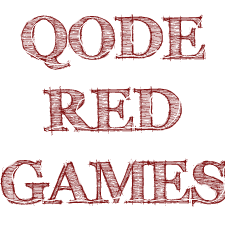

<div id="top"></div>
<!--
*** Thanks for checking out SquareFace, my first Unity game for Android. If you have a suggestion
*** that would make this better, please fork the repo and create a pull request
*** or simply open an issue with the tag "enhancement".
*** Don't forget to give the project a star!
*** Thanks again!
-->


<!-- PROJECT QODE RED -->
<!--
*** I'm using markdown "reference style" links for readability.
*** Reference links are enclosed in brackets [ ] instead of parentheses ( ).
*** See the bottom of this document for the declaration of the reference variables
*** for contributors-url, forks-url, etc. This is an optional, concise syntax you may use.
*** https://www.markdownguide.org/basic-syntax/#reference-style-links
-->
[![Contributors][contributors-shield]][contributors-url]
[![Forks][forks-shield]][forks-url]
[![Stargazers][stars-shield]][stars-url]
[![Issues][issues-shield]][issues-url]
[![MIT License][license-shield]][license-url]
[![LinkedIn][linkedin-shield]][linkedin-url]

<!-- PROJECT LOGO -->
<br />
<div align="center">
  <a href="https://github.com/RichardManthorpe/squareface">
    
  </a>

  <h3 align="center">SquareFace</h3>

  <p align="center">
    ...My first Unity game for Android...
    <br />
    <a href="https://github.com/RichardManthorpe/squareface"><strong>Explore the docs »</strong></a>
    <br />
    <br />
    <a href="https://github.com/RichardManthorpe/squareface">View Demo</a>
    ·
    <a href="https://github.com/RichardManthorpe/squareface/issues">Report Bug</a>
    ·
    <a href="https://github.com/RichardManthorpe/squareface/issues">Request Feature</a>
  </p>
</div>


<!-- TABLE OF CONTENTS -->
<details>
  <summary>Table of Contents</summary>
  <ol>
    <li>
      <a href="#about-the-project">About The Project</a>
      <ul>
        <li><a href="#built-with">Built With</a></li>
      </ul>
    </li>
    <li>
      <a href="#getting-started">Getting Started</a>
      <ul>
        <li><a href="#prerequisites">Prerequisites</a></li>
        <li><a href="#installation">Installation</a></li>
      </ul>
    </li>
    <li><a href="#usage">Usage</a></li>
    <li><a href="#roadmap">Roadmap</a></li>
    <li><a href="#contributing">Contributing</a></li>
    <li><a href="#license">License</a></li>
    <li><a href="#contact">Contact</a></li>
    <li><a href="#acknowledgments">Acknowledgments</a></li>
  </ol>
</details>


<!-- ABOUT THE PROJECT -->
## About The Project
<center>&nbsp;&nbsp;</center>

 Good catchy games, like music, stay with you forever. I've always enjoyed building and playing simple but addictive games. Ever since college when I remember building a projectile game on a graphical calculator, and then experiementing with BASIC programming on the first macs. I fondly remember the hours spent in front of the Atari console as a child, jumping the small sprite over barrels to the top of the ramps where donkey kong was holding the kidnapped girlfriend, before moving on to space invaders, missile command, combat and asteroids...and what was that driving game... before moving on to Chucky Egg on the Spectrum and then Tetris on the Gameboy.
 I find games are like films. The newer, cleverer, busier, more action packed films are less fun than the simple old films with a solid but kinda prectable story-line.

The motivations for building this first Unity game are:
* to keep my coding skills up to par as I progress in my career.
* to keep learning new coding tools, techniques and languages while building something I enjoy.

My goals for building games are:
* to build for the various mobile devices and operating systems on the markets.
* to build simple, fun, addictive games for kids of all ages.
* to build games with a trade mark "edge" that defines Qode Red Games.

<p align="right">(<a href="#top">back to top</a>)</p>


### Built With

* [Unity](https://unity.com/)

<p align="right">(<a href="#top">back to top</a>)</p>


<!-- GETTING STARTED -->
## Getting Started

To get a local copy up and running follow these simple steps.

### Prerequisites

This is a list things you need to use the software and how to install them.
* Windows, Mac or Linux Operating System

### Installation

1. Download the correct flavour of Unity for your OS [https://unity.com/download](https://unity.com/download)
2. Create a new Project in Unity called "squareface"
3. Clone the squareface repo
   ```
   git clone https://github.com/RichardManthorpe/squareface.git
   ```
4. Copy the repo contents into your squareface project
5. Test run in Unity and then build.

<p align="right">(<a href="#top">back to top</a>)</p>


<!-- USAGE EXAMPLES -->
## Usage

* Jump SquareFace over the platforms.
* Don't fall between the platforms.
* Don't hit a platform edge or corner.'
* Beat the high score!

<p align="right">(<a href="#top">back to top</a>)</p>


<!-- ROADMAP -->
## Roadmap

- [X] Build for Android
- [X] Add Changelog
- [X] Create start screen
- [X] Create high score screen
- [X] Increase speed
- [X] Enemies
- [X] Collectables
- [X] Next Levels
- [X] Tilt Controls
- [ ] Improved Images
- [ ] Improved Sounds
- [ ] Levels
- [ ] IOS
- [ ] Unique edge!?
- [ ] Adverts
- [ ] Multi-language Support
    - [ ] Chinese
    - [ ] Spanish

See the [open issues](https://github.com/RichardManthorpe/squareface/issues) for a full list of proposed features (and known issues).

<p align="right">(<a href="#top">back to top</a>)</p>


<!-- CONTRIBUTING -->
## Contributing

Contributions are what make the open source community such an amazing place to learn, inspire, and create. Any contributions you make are **greatly appreciated**.

If you have a suggestion that would make this better, please fork the repo and create a pull request. You can also simply open an issue with the tag "enhancement".
Don't forget to give the project a star! Thanks again!

1. Fork the Project
2. Create your Feature Branch (`git checkout -b feature/AmazingFeature`)
3. Commit your Changes (`git commit -m 'Add some AmazingFeature'`)
4. Push to the Branch (`git push origin feature/AmazingFeature`)
5. Open a Pull Request

<p align="right">(<a href="#top">back to top</a>)</p>


<!-- LICENSE -->
## License

Distributed under the MIT License. See `LICENSE.txt` for more information.

<p align="right">(<a href="#top">back to top</a>)</p>


<!-- CONTACT -->
## Contact

Twitter: [@Moohar](https://twitter.com/moohar) - rmanthorpe@gmail.com

Project Link: [https://github.com/RichardManthorpe/squareface](https://github.com/RichardManthorpe/squareface)

<p align="right">(<a href="#top">back to top</a>)</p>


<!-- ACKNOWLEDGMENTS -->
## Acknowledgments

Resources I've found helpful and would like to give credit to!

* [Choose an Open Source License](https://choosealicense.com)

<p align="right">(<a href="#top">back to top</a>)</p>


<!-- MARKDOWN LINKS & IMAGES -->
<!-- https://www.markdownguide.org/basic-syntax/#reference-style-links -->
[contributors-shield]: https://img.shields.io/github/contributors/RichardManthorpe/squareface.svg?style=for-the-badge
[contributors-url]: https://github.com/RichardManthorpe/squareface/graphs/contributors
[forks-shield]: https://img.shields.io/github/forks/RichardManthorpe/squareface.svg?style=for-the-badge
[forks-url]: https://github.com/RichardManthorpe/squareface/network/members
[stars-shield]: https://img.shields.io/github/stars/RichardManthorpe/squareface.svg?style=for-the-badge
[stars-url]: https://github.com/RichardManthorpe/squareface/stargazers
[issues-shield]: https://img.shields.io/github/issues/RichardManthorpe/squareface.svg?style=for-the-badge
[issues-url]: https://github.com/RichardManthorpe/squareface/issues
[license-shield]: https://img.shields.io/github/license/RichardManthorpe/squareface.svg?style=for-the-badge
[license-url]: https://github.com/RichardManthorpe/squareface/blob/master/LICENSE.txt
[linkedin-shield]: https://img.shields.io/badge/-LinkedIn-black.svg?style=for-the-badge&logo=linkedin&colorB=555
[linkedin-url]: https://www.linkedin.com/in/richard-manthorpe-52b5a51/
[product-screenshot]: images/screenshot.png